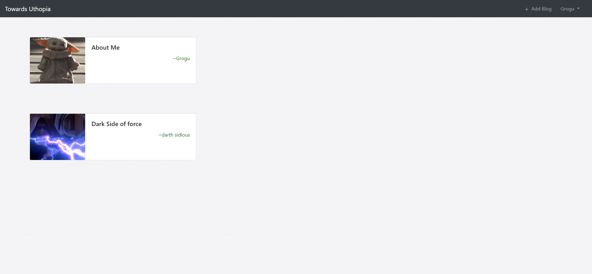
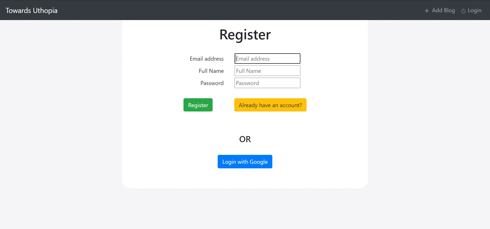
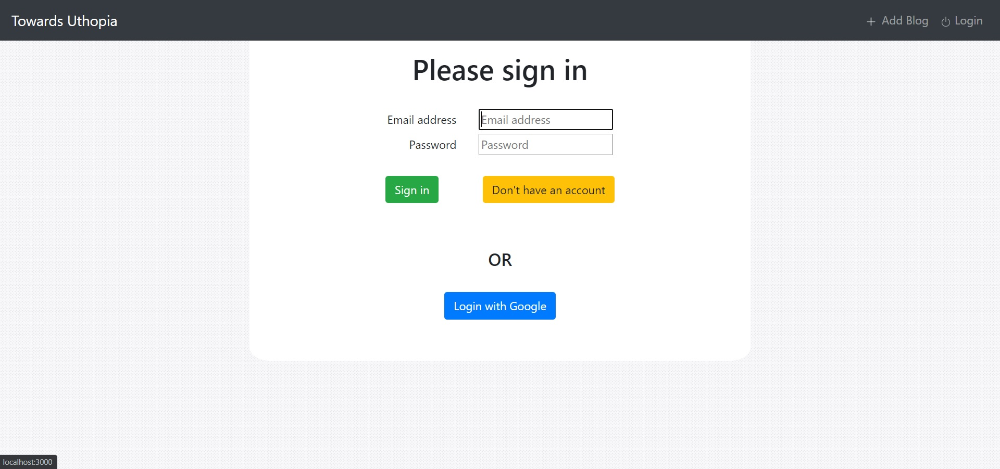
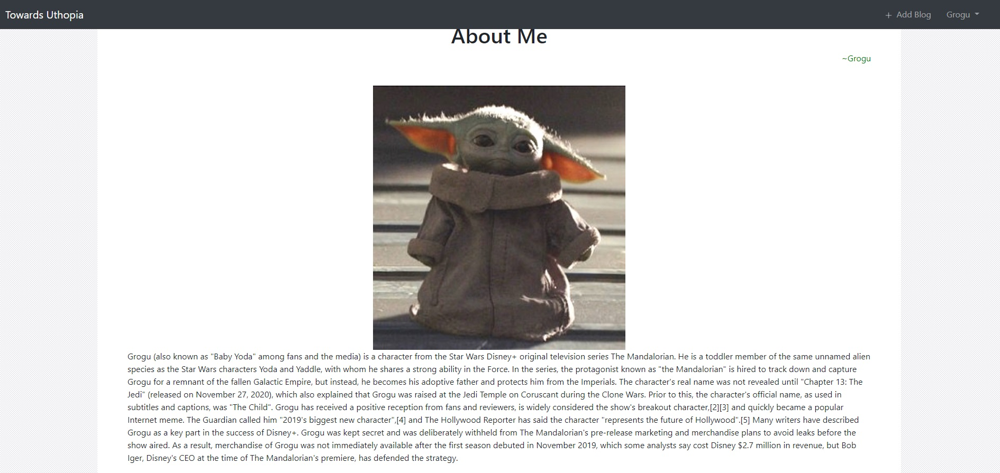
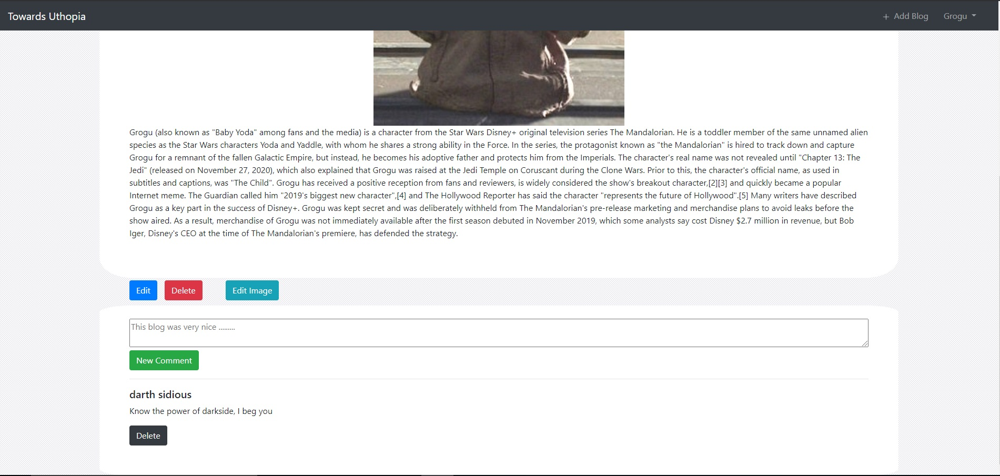
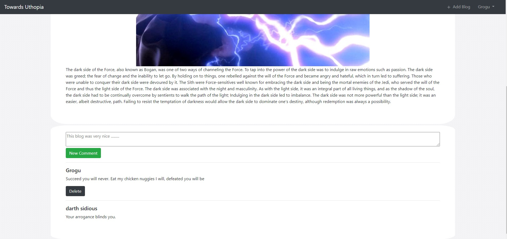

# Towards Uthopia Blog
This is a Blogging website made with Express-Nodejs and uses MongoDb as database. It uses EJS for server-side rendering engine and supports google o-auth2 along with normal authentication.
It uses JWT-Tokens for auth and also has protected routes. Its functioning is based on REST Framework.
It also supports image uploading which is done through multer.

## Some screenshots
<br/>
<br/>
<br/>
<br/>
<br/>
<br/>

## Install dependencies
Make sure you have `Node.js` installed
```console
$ npm install
```
go to `.env copy` file, fill the value of environment variables and rename the file to `.env`


## Run the application
```console
$ npm start 
```
